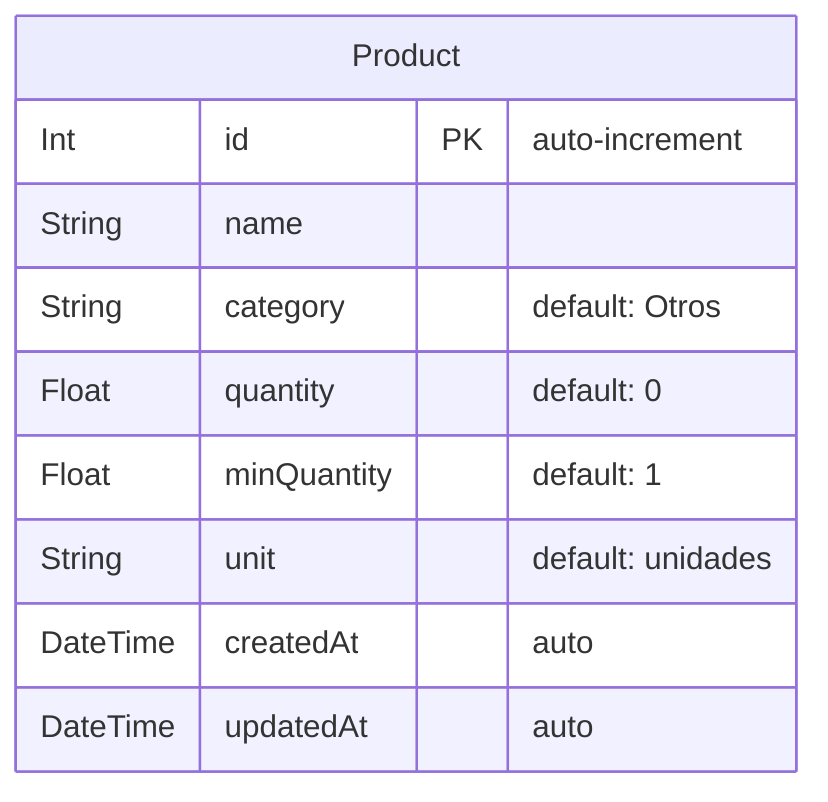
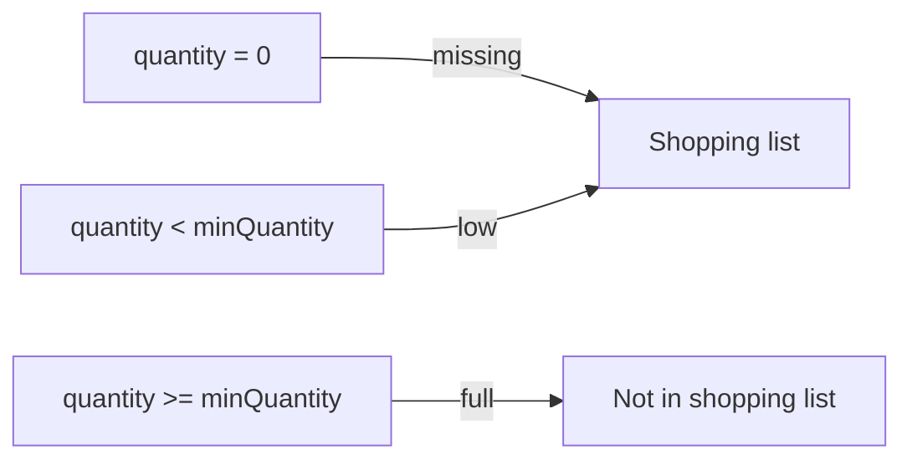

# Ingredients Planner

A web app to manage your kitchen inventory and automatically generate shopping lists. The entire UI is in Spanish.

## Tech Stack

- **Next.js 16** — App Router, TypeScript, Turbopack
- **Tailwind CSS v4** — `@theme inline` directives, iOS-inspired design tokens
- **Prisma v7** — ORM with `@prisma/adapter-libsql` driver adapter
- **SQLite** — Local database via `@libsql/client`

## Features

- **Kitchen View** — Full ingredient inventory grouped by category, with smart search (case and accent insensitive)
- **Shopping View** — Auto-generated list of out-of-stock and low-stock items, with quantity summary
- **Auto-categorization** — Automatically classifies products into Spanish categories (Dairy, Meat & Seafood, Vegetables, Fruits, etc.) using both Spanish and English keywords
- **Copy List** — Copy the shopping list to clipboard in the format `1. 2 Leche`
- **Restock** — Modal to register purchases and update inventory
- **Full CRUD** — Add, edit, and delete products with validation

## Getting Started

```bash
npm install
npx prisma migrate dev
npm run dev
```

Open [http://localhost:3000](http://localhost:3000) in your browser.

### Production

```bash
npm run build
npm run start
```

## Project Structure

```
src/
├── app/
│   ├── api/
│   │   ├── products/          # CRUD endpoints for products
│   │   │   ├── route.ts       # GET (list) / POST (create)
│   │   │   └── [id]/route.ts  # PUT (update) / DELETE
│   │   └── shopping-list/
│   │       └── route.ts       # GET — filtered list (missing + low stock)
│   ├── globals.css            # Tailwind v4 + iOS theme tokens
│   ├── layout.tsx             # Root layout (es locale)
│   └── page.tsx               # Entry point
├── components/
│   ├── AppShell.tsx           # Root client component, Cook/Shopper toggle
│   ├── ViewToggle.tsx         # Tab switcher (Cocina / Compras)
│   ├── cook/
│   │   ├── CookView.tsx       # Inventory view with search + CRUD
│   │   ├── ProductCard.tsx    # Individual product card with status badge
│   │   ├── ProductForm.tsx    # Add/edit product modal form
│   │   └── ProductList.tsx    # Grouped product list with accent-insensitive search
│   ├── shopper/
│   │   ├── ShopperView.tsx    # Shopping list view with copy + restock
│   │   ├── ShoppingItem.tsx   # Individual shopping item row
│   │   └── ShoppingList.tsx   # Grouped shopping list (out-of-stock / low stock)
│   └── ui/                    # Reusable UI primitives
│       ├── Badge.tsx
│       ├── Button.tsx
│       ├── Card.tsx
│       ├── EmptyState.tsx
│       ├── Input.tsx
│       ├── Modal.tsx
│       ├── SearchBar.tsx
│       ├── Select.tsx
│       └── Stepper.tsx
├── hooks/
│   ├── useProducts.ts         # Products CRUD hook
│   └── useShoppingList.ts     # Shopping list fetch + restock hook
├── lib/
│   ├── categorize.ts          # Auto-categorization with ES/EN keywords
│   ├── prisma.ts              # Singleton Prisma client (libsql adapter)
│   └── types.ts               # Shared types + computeStatus helper
└── generated/prisma/          # Prisma generated client
```

## Categories

Products are auto-categorized using Spanish and English keywords:

| Category (ES) | Translation | Examples |
|---|---|---|
| Lacteos | Dairy | Leche, Queso, Yogurt, Huevos |
| Carnes y Mariscos | Meat & Seafood | Pollo, Carne de res, Tilapia, Atun |
| Verduras | Vegetables | Tomate, Cebolla, Zanahoria, Lechuga |
| Frutas | Fruits | Mango, Fresa, Aguacate, Banana |
| Granos y Cereales | Grains & Cereals | Arroz, Pasta, Quinua, Granola |
| Especias y Condimentos | Spices & Seasonings | Sal, Pimienta, Oregano, Comino |
| Bebidas | Beverages | Cafe, Jugo, Agua, Te |
| Reposteria | Baking | Azucar, Chocolate, Miel, Harina |
| Salsas y Aderezos | Sauces & Dressings | Mayonesa, Salsa, Vinagreta, Aceite |
| Snacks y Botanas | Snacks | Papitas, Galletas, Palomitas |
| Otros | Other | Anything unmatched |

## Database

SQLite database at `dev.db` (project root). Schema defined in `prisma/schema.prisma`.



### Status Logic

A product's status is computed from `quantity` and `minQuantity`:


